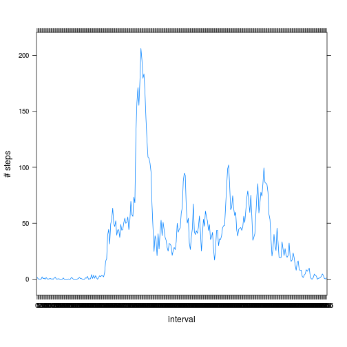

Assignment 1
========================================================

**Question1**


```r
library(lubridate)
dataset <- read.csv("./activity.csv")


dataset$date <- as.Date(dataset$date, "%Y-%m-%d")
dataset$weekday <- wday(dataset$date, label = T, abbr = T)
dataset$weekday <- as.factor(dataset$weekday)
dataset$interval <- as.factor(dataset$interval)
class(dataset$weekday)
```

```
## [1] "ordered" "factor"
```

```r


days <- as.factor(dataset$date)
```


Make a histogram of the total number of steps taken each day


```r
plot(table(wday(dataset$date, label = T, abbr = T)))
```

 


Calculate and report the mean and median total number of steps taken per day

Mean:

```r
tapply(dataset$steps, dataset$weekday, mean, na.rm = T)
```

```
##   Sun   Mon  Tues   Wed Thurs   Fri   Sat 
## 42.63 34.63 31.07 40.94 28.52 42.92 43.53
```


Median:

```r
tapply(dataset$steps, dataset$weekday, median, na.rm = T)
```

```
##   Sun   Mon  Tues   Wed Thurs   Fri   Sat 
##     0     0     0     0     0     0     0
```


**Question2**

Make a time series plot (i.e. type = "l") of the 5-minute interval (x-axis) and the average number of steps taken, averaged across all days (y-axis)


```r

listaIntervalli <- split(x = dataset, f = dataset$date)
listaIntervalli <- listaIntervalli[[1]]["interval"]


library(lattice)
mediaStep <- tapply(dataset$steps, dataset$interval, mean, na.rm = T)


xyplot(mediaStep ~ listaIntervalli, type = "l", ylab = "# steps", xlab = "interval", 
    las = 2, par.settings = list(layout.heights = list(top.padding = 3, bottom.padding = 5)))
```

 


Which 5-minute interval, on average across all the days in the dataset, contains the maximum number of steps?


```r
names(which.max(x = mediaStep))
```

```
## [1] "835"
```


**Question3**


Length of null values

```r
average <- tapply(dataset$steps, dataset$weekday, mean, na.rm = T)
naElem <- dataset[is.na(dataset$steps), ]
length(naElem$steps)  # null values
```

```
## [1] 2304
```


Transform null values with mean value

```r
days <- as.factor(dataset$date)
X <- split(dataset, days)

for (i in 1:length(X)) {
    for (j in 1:length(X[[i]][, "steps"])) {
        
        
        if (is.na(X[[i]][j, "steps"])) {
            
            giorno <- X[[i]][j, "date"]
            
            X[[i]][j, "steps"] <- average[wday(giorno)]
        }
    }
    
}

# unisco il dataset
newdataset <- data.frame(steps = {
}, date = {
}, interval = {
})
for (i in 1:length(X)) {
    newdataset <- rbind(newdataset, data.frame(steps = X[[i]]["steps"], date = X[[i]]["date"], 
        interval = X[[i]]["interval"]))
    
}
```


New mean value

```r
tapply(newdataset$steps, dataset$weekday, mean, na.rm = T)
```

```
##   Sun   Mon  Tues   Wed Thurs   Fri   Sat 
## 42.63 34.63 31.07 40.94 28.52 42.92 43.53
```


New median value

```r
tapply(newdataset$steps, dataset$weekday, median, na.rm = T)
```

```
##   Sun   Mon  Tues   Wed Thurs   Fri   Sat 
##     0     0     0     0     0     0     0
```

